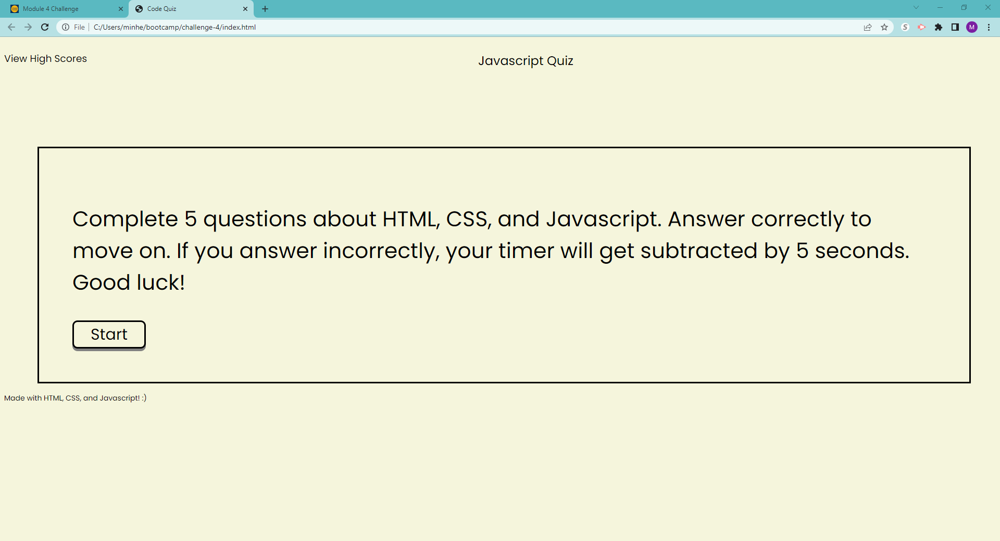
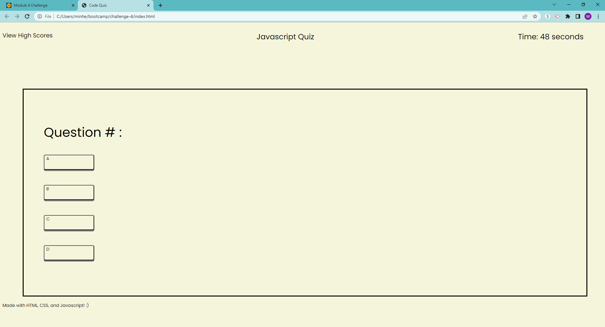
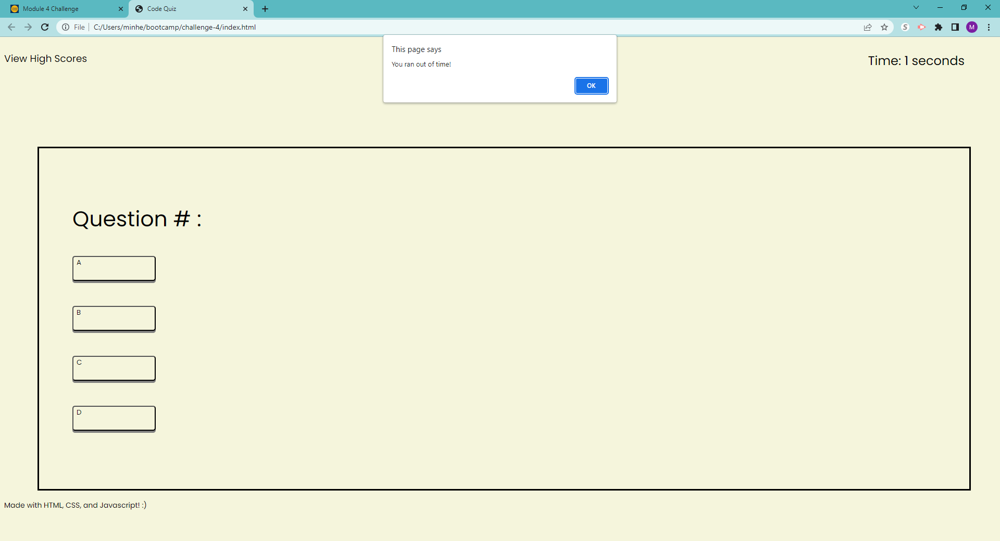

# challenge-4

## Description

The purpose of this project is to test user's understanding of coding concepts we learned in class. I learned how to utilize HTML, CSS, and JavaScript together to create a functioning quiz. I did struggle with this project and would like to use a resubmission for this challenge. I will turn a new one in over the weekend!

## Installation

N/A

## Usage

This is the starting page of the quiz when directed to the website.

The timer will start countind down after you press the start button and you will be redirected to the quiz screen.

Once the timer reaches 0 and you don't complete the quiz in time, the website will alert you!

## Credits

css-tricks: https://css-tricks.com/snippets/css/a-guide-to-flexbox/

stackoverflow: https://stackoverflow.com/questions/37252041/storing-quiz-questions-in-array-of-objects

w3schools: https://www.w3schools.com/css/css3_buttons.asp

Learning Assistant Jerromy

TA Zubair Shaikh